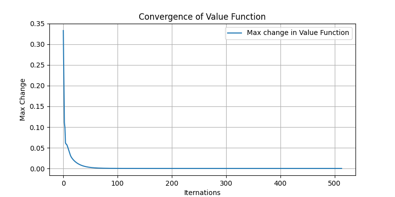
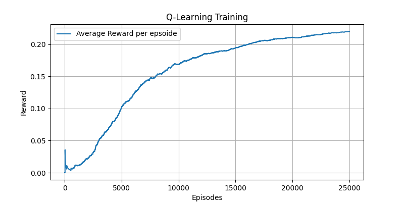
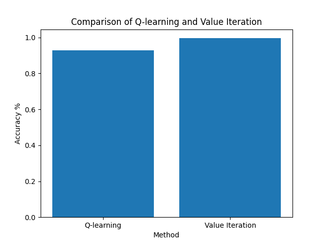

## Step 1: Introduction to OpenAI Gym

OpenAI Gym offers a variety of environments to experiment with different reinforcement learning algorithms. For this assignment, the FrozenLake-v1 environment is utilized, which is a grid-based game where the objective is to navigate from the starting point to the goal without falling into holes.

### Code Implementation and Functionality

#### Environment Setup and Initial State
The `gym.make()` function is used to create an instance of an environment; `FrozenLake-v1` is specified along with a randomly generated map. The `reset()` method initializes the environment at the start of each new episode and returns the initial state. It is essential for starting or resetting the game.

```python
import gym
from gym.envs.toy_text.frozen_lake import generate_random_map

random_map = generate_random_map(size=8, p=0.6)
env = gym.make('FrozenLake-v1', desc=random_map)
observation, info = env.reset()
```

#### Interaction with the Environment
The `step()` function is used to execute an action in the environment, which returns several important pieces of information:
- `observation`: the new state after the action.
- `reward`: numerical reward received for taking the action.
- `terminated`: a boolean indicating whether the episode has ended (e.g., reaching the goal or falling into a hole).
- `truncated`: a boolean indicating if the episode was cut off (e.g., reaching a maximum number of steps allowed in some environments).
- `info`: a dictionary with extra information about the environment.

During each timestep, a random action is chosen from the action space of the environment using `action_space.sample()`. The environment’s response to this action is observed by calling the `step()` function.

```python
for _ in range(1000):
    action = env.action_space.sample()
    observation, reward, terminated, truncated, info = env.step(action)
    
    if terminated or truncated:
        observation, info = env.reset()
```


## Step 2: FrozenLake-v1 as an MDP

### States
- The FrozenLake-v1 environment consists of a grid of tiles, with each tile representing a state.
- In the default 4x4 grid, there are 16 possible states numbered from 0 to 15, arranged row by row.

### Actions
- At each state, the agent can take one of four possible actions: move left, down, right, or up.
- These actions correspond to the directions the agent can move on the grid.

### Rewards
- The goal of the agent is to navigate from the starting state to the goal state, avoiding holes along the way.
- The agent receives a reward of 1 upon reaching the goal state and 0 otherwise.
- Falling into a hole results in a reward of 0 and terminates the episode.

### Transitions
- The movement of the agent in the environment is stochastic, influenced by the 'slippery' nature of the ice.
- While the agent selects an action, there is a chance that it will slip and move in a different direction from the one intended.
- The transition dynamics are encapsulated in the transition probabilities defined by the environment.

### Dynamics
- The FrozenLake-v1 environment exhibits the Markov property, meaning that the future state depends only on the current state and the action taken.
- Each state has a transition probability distribution associated with it, indicating the likelihood of moving to each possible next state given a particular action. 

<div style="page-break-after: always;"></div>

## Step 3: Implementing Value Iteration

### Code: [value_iteration.py](./value_iteration.py)
### Convergence of the state value function: 

### Policy Derivation Process
```python
def find_policy(env, value_table, gamma = 1.0):
    policy = np.zeros(env.observation_space.n)
    for state in range(env.observation_space.n):
        Q_values = [sum([prob*(reward + gamma*value_table[next_state]) 
                         for prob, next_state, reward, _ in env.P[state][action]]) 
                    for action in range(env.action_space.n)]
        policy[state] = np.argmax(np.array(Q_values))
    return policy
```
The function iterates over each state in the environment and computes the expected return of taking each action from that state. It calculates the expected return by summing the rewards weighted by their probabilities of occurrence, considering the future discounted rewards represented by the optimal state values.

For each state-action pair, the function computes the Q-value, which represents the expected return of taking that action from the current state. The Q-values are stored in a list for all possible actions from the current state.

Finally, the function selects the action with the highest Q-value for each state, effectively determining the optimal action to take in each state. These optimal actions collectively form the derived policy, which guides the agent's decision-making process during navigation within the environment.

## Step 4: Implementing Q-Learning

### Code: [q_learning.py](./q_learning.py)

### The learning curve (rewards over episodes):


### Comparing the performance of the learned policy against the policy from Value Iteration:


